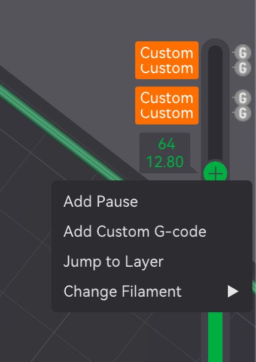

[](https://doi.org/10.5281/zenodo.13835039)

# GcodeGoblin

GcodeGoblin is a small python script for post-processing G-Code. 

For 3d printing, this allows for various hacks, like skipping entire layers (with `...CUT` commands), or repeating layers with alternate
settings (with `...COPY` commands).

It provides the following post-processing commands:

- `; START_COPY: <buffer-name>`: Starts to copy the following lines into a named buffer
- `; STOP_COPY`: End of the copying
- `; PASTE: <buffer-name>`: Pastes the named buffer here
- `; START_CUT`: Suppresses the following lines
- `; STOP_CUT`: prints the following lines.

Note that the semicolon (;) indicates that the following characters are G-Code comments.

## Files

The tool works on both `.3mf` files as generated by the Bambu and Orca slicer (it recaclucates the required checksum
file also), and it also works on plain `.gcode` files.

## Integration notes
As of September 2024, the `Others -> Post-processing scripts` feature in Bambu and Orca slicer appears not to work.


## Example

```gcode
;; filename: example.gcode
G1
; START_COPY: A
G2
; STOP_COPY
G3
; START_CUT
G4
; STOP_CUT
G5
; PASTE: A
```

running `python gcodegoblin.py example.gcode`
should yield 

```gcode
;; filename: example.fixed.gcode
G1
; START_COPY: A
; starting to copy into buffer A
G2
; STOP_COPY: A
; stopping copy into buffer A
G3
; START_CUT
; CUT START
; CUT STOPPED
G5
; PASTE: A
; pasting from buffer A into output:
G2
; END OF PASTE BUFFER
```

## Real world example

In 3d printer slicer (Prusa, Orca, Bambu, maybe others), you can right click on the + on the top end of the Z-Axis slider to get a little menu that allows you to add custom G-Code, like the `; START_COPY: A` etc. This will be put into the G-Code that is generated next time you slice it. 



The workflow is:

1. Load Model
1. Slice Model
1. Insert G-Code with the right-click
1. Slice Model again
1. Export G-Code with `Export plate sliced file` or similar option
1. Run `GcodeGoblin` on the generated file
1. Print the generated file

Generally, repeating a previous layer with a lower flow rate allows solid bonding of membranes.
